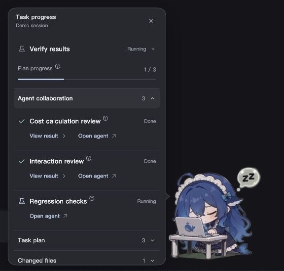
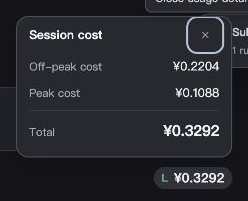

<div align="center">

# Kujira

**A quiet, animated companion for real DeepSeek Harness work.**

[简体中文](README.md) · [Releases](https://github.com/YuluoY/dsh-kujira/releases) · [Issues](https://github.com/YuluoY/dsh-kujira/issues) · [Extension API](docs/EXTENSIONS.md)

[](LICENSE)
[](https://github.com/YuluoY/dsh-kujira/releases)
[](https://github.com/YuluoY/dsh-kujira/stargazers)



*Real component screenshots with isolated demo tasks and estimated costs.*

</div>

## Features

- **Real task context.** Thinking, working, waiting, completion and errors, with progressively revealed plans, tool results, modified files and subagents. Open supported destinations in the host.
- **50 transparent animations.** Idle gestures, work transitions, a three-part sleep sequence, dragging, feeding, weather and wallet actions. Task state takes priority; reduced motion and static companionship are supported.
- **Global tariff scheduling.** Pause all main agents and subagents in the same DSH service at peak-price step boundaries; resume the original work off-peak.
- **Compact session costs.** A right-aligned composer entry shows only the tariff marker and session estimate. Its small popover contains off-peak, peak and total amounts.
- **Balances and weather.** Official DeepSeek balances retain their original currency. Leave the city blank for automatic location or specify one. Follow the system or select China, United States, Korea or Russia.
- **Optional companion inventory.** Verifiable DeepSeek usage estimates earn randomized interaction supplies. A free-interaction setting removes inventory consumption.
- **Extensible radial menu.** Hide the GitHub shortcut, choose 3–8 buttons per page including More, or register external actions.

## Screenshots

<p align="center"></p>

Panels grow downward to a maximum of 520px or 78% of the viewport. Content scrolls beyond the cap while headers and settings actions remain visible. Large task collections start with eight rows. Technical details stay behind their relevant action instead of dominating the overview.

## Install in DSH

Start with a working DeepSeek Harness Web installation. DSH supplies React, slots, sessions and agents; no separate frontend build is needed.

```bash
git clone https://github.com/YuluoY/dsh-kujira.git
cd dsh-kujira
npm run link
```

Restart DSH Web and refresh the page. Alternatively, extract the plugin archive from [Releases](https://github.com/YuluoY/dsh-kujira/releases) and run the same link command inside the extracted directory.

```bash
npm run unlink
```

Balance queries use your existing DSH DeepSeek credentials. Keys stay on the host. Missing credentials produce an explicit unavailable state, never a fabricated balance.

### Global peak/off-peak scheduling

Enable **Settings → Global session schedule → Run off-peak**. It is off by default and persists on the host.

| Event | Behavior |
|---|---|
| Peak tariff | Global `agent/pre-step` gate blocks the next step for main agents and subagents. |
| Off-peak tariff | Release each waiting original continuation. No synthetic “continue” prompt is submitted. |
| Manual cancellation | Cancelled work stays cancelled; off-peak scheduling does not resurrect it. |
| Disable scheduling | Immediately release scheduler-held steps. |

An already-issued model request or running tool finishes before the pause. This does not retract requests or reverse charges. The scope is **one DSH service process**, not independent installations on other machines. The active pricing configuration and its time zone define tariff boundaries; UI language does not.

Local preview has no real DSH agents and is labelled accordingly. The installed host uses real lifecycle hooks. Unsupported host capabilities display an unavailable state instead of reporting a false success.

### Amounts and inventory

`total_balance` is available credit, `topped_up_balance` is remaining paid credit, and `granted_balance` is granted credit. None is a lifetime deposit total. Country selection changes formatting, **not account currency**. Session costs are estimates from verifiable usage records and prices, not an official invoice.

By default, every CNY 0.10 of eligible usage estimates earns one supply. Each randomized five-drop bag contains two fish snacks and one pat, play and stretch action. Interactions share a cooldown. Free mode preserves inventory; preview usage never earns real supplies.

## Preview and development

```bash
npm ci --legacy-peer-deps
npm run preview
# Default: http://127.0.0.1:8792/
# Custom: PREVIEW_PORT=8793 npm run preview
```

The preview offers task states, tariff examples and a long-content/many-tasks scenario. Task and cost fixtures are isolated from production routes. Balance and weather panels may still query real services; keep private account information out of public screenshots.

```bash
npm test
npm run lint
npm run typecheck
```

There is no frontend build step. Strict type checking covers annotated status, geometry, locale and resource models; dynamically injected React factories remain JavaScript.

```text
lib/client.js                  DSH browser module and slot registration
lib/index.js                   Host routes and service composition
lib/host/                      Sessions, balance, usage, inventory, scheduler
lib/shared/client/             Mascot state, animation, layout, menus, panels
lib/shared/task/               Task store, status semantics, progressive UI
lib/shared/feature-registry.js  External feature registration
lib/shared/locales/            Chinese, English, Korean and Russian
lib/styles/                    Component styles, combined by the host
assets/anim/                   50 transparent WebM clips
assets/pet.config.json         Behavior and layout configuration
tools/                         Tests and isolated local preview
```

[Extension contract and examples](docs/EXTENSIONS.md) · [Full animation mapping](docs/ANIMATIONS.md)

## Compatibility and validation

The implementation was checked against locally obtained DSH source for `agent/pre-step`, `conversation.composer.dock`, session snapshots and subagent navigation. Automated tests and browser previews have been verified. Compatibility with every real DSH version is not claimed. The supplied WebM clips do not provide independent pupil tracking.

## Star History

[](https://www.star-history.com/#YuluoY/dsh-kujira&Date)

[Star History](https://www.star-history.com/blog/how-to-use-github-star-history/) draws the chart from actual GitHub stars. A new repository needs data to accumulate; images may be cached.

## License and credits

Code is [MIT licensed](LICENSE). Animations come from [yanzwzz/dsh-whale-girl-pet](https://github.com/yanzwzz/dsh-whale-girl-pet), retaining their copyright and MIT license. Thanks to [PC2005-cloud/dsh-pet](https://github.com/PC2005-cloud/dsh-pet) for reference implementations. Vendored i18next retains its [license](lib/shared/vendor/i18next.LICENSE). This is a community plugin, not an official DeepSeek product.
