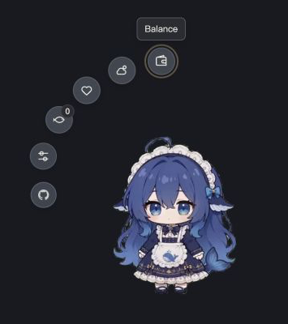
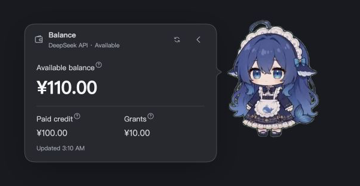

<div align="center">

# Kujira

**A desktop companion for DeepSeek Harness Web** — track agent tasks, session costs and account balances, with off-peak scheduling, pet interactions and an optional standalone desktop mode.

[简体中文](README.md) · [Releases](https://github.com/YuluoY/dsh-kujira/releases) · [Usage](docs/USAGE.en.md) · [Desktop mode](docs/DESKTOP.md) · [Issues](https://github.com/YuluoY/dsh-kujira/issues)

[](https://github.com/YuluoY/dsh-kujira/releases) [](https://github.com/YuluoY/dsh-kujira/actions/workflows/desktop.yml) [](LICENSE)



<sub>Isolated preview screenshots. The balance panel below uses demo amounts.</sub>

</div>

## ✨ Features

- **Task progress** — current operations, plans and subagents, with expandable results, files and links to their sessions.
- **Tariff scheduling** — pause main agents and subagents during peak hours and resume off-peak within the same DSH service. Off by default; enable in settings.
- **Costs and balances** — tariff status and combined parent/subagent costs at the bottom right of the composer; balances from your configured DSH DeepSeek account.
- **Pet interactions** — 130 transparent clips of the same character covering idle, work, daily routines, holidays and interactions. Continuous use has no cooldown; configurable spending thresholds and probabilities award random bundles, with an unlimited mode. Reactions make no model requests and never preload the full library.
- **Desktop mode** — a standalone Electron app sharing the mascot, animations and settings with the browser plugin. Browser/desktop display handoff, tray menu, transparent-area click-through, always-on-top and on-demand DSH launch from the mascot menu or tray.
- **Preferences** — position, size, bubble duration and menu size. Changes autosave with debouncing. Chinese, English, Korean and Russian, or follow the system.
- **Extensions** — weather, a GitHub shortcut and an [API for external menu actions](docs/EXTENSIONS.md).

<div align="center">
  
</div>

## 📦 Installation

Requires Node.js 22.13+, pnpm and a working DeepSeek Harness Web installation, with `dsh` and `pnpm` on PATH.

Run one command from any directory on macOS, Linux or Windows:

```sh
dsh plugin --profile web add https://github.com/YuluoY/dsh-kujira/releases/download/v0.2.1/dsh-kujira-0.2.1.tgz
```

DSH downloads, installs and registers the plugin. No Git clone, manual extraction or project directory is needed. Let active sessions finish, then restart DSH Web and refresh the page. The URL pins an explicit version; use a newer release URL when upgrading.

```sh
dsh plugin --profile web remove dsh-kujira
```

For local source development, `npm run setup` remains available — see [installation, updates and removal](docs/INSTALL.md).

Installation, live balances and historical session reads were verified with DSH **0.1.5-rc.1**. Scheduling was tested through that version’s agent event dispatcher.

## 📖 Before you start

- Scheduling takes effect at **agent step boundaries**: an issued model request or running tool finishes first. Manually cancelled tasks stay cancelled; other independently running DSH services are outside its scope.
- Balance queries reuse `DEEPSEEK_API_KEY` from DSH's credentials service and need a valid official DeepSeek API key. Credentials stay on the host and are never sent to the browser.
- Weather needs no separate API key: leave the city blank to locate by the DSH server's outbound IP, or enter a city to override it; domestic and international providers include failover.
- Country selection converts displayed amounts to CNY, USD, KRW or RUB using Frankfurter reference rates (converted amounts show ≈); account and settlement currencies remain unchanged.

Further docs: [Scheduling and supply rules](docs/USAGE.en.md) · [Data and privacy](docs/PRIVACY.md) · [Animation triggers](docs/ANIMATIONS.md) · [Performance and inventory migration](docs/PERFORMANCE.md) · [Desktop mode](docs/DESKTOP.md)

## 🖥️ Optional desktop mode (preview)

The desktop app runs standalone and opens the local DSH from the mascot menu; plugin installation is unchanged and the desktop runtime is installed separately. Appearance and the local companion snapshot sync between browser and desktop, while inventory, rewards and scheduling stay with the DSH service — no offline transactions are faked. Platform boundaries, defaults and build steps are documented in [desktop mode](docs/DESKTOP.md). Optional unsigned desktop previews are listed in the [v0.2.1 Release](https://github.com/YuluoY/dsh-kujira/releases/tag/v0.2.1) assets.

## 🛠️ Development

```bash
npm ci --legacy-peer-deps
npm run preview   # http://127.0.0.1:8792/
npm test          # includes test:desktop for the desktop modules
npm run lint
npm run typecheck
```

Desktop app development and local builds:

```bash
npm run desktop:install
npm run desktop:start
npm run desktop:build
```

No frontend build is required. Host services live in `lib/host`, UI in `lib/shared/client` and `lib/shared/task`, styles in `lib/styles`, and the Electron app in `desktop/`. Type checking covers annotated models and resource modules. Inventory uses transactional SQLite in a background worker (Node 22.13+); existing JSON inventory migrates automatically and remains as a backup.

The preview includes task states, cost examples and long-content fixtures. Tasks and costs use isolated demo data; balance and weather panels may call real services.

## 🤝 Contributing and contact

[Issues](https://github.com/YuluoY/dsh-kujira/issues) and [pull requests](https://github.com/YuluoY/dsh-kujira/pulls) are welcome: bug reports, feature ideas, documentation fixes and code improvements. For larger changes, please open an issue first.

Include your DSH version, reproduction steps and relevant screenshots in bug reports, with secrets and private content redacted. Check long text, small windows and all four languages when changing the UI.

Contact the maintainer: [@YuluoY on GitHub](https://github.com/YuluoY) · Personal blog: [uluo.cloud](https://uluo.cloud/). Please use issues for project questions.

## 🌸 Credits

- [yanzwzz/dsh-whale-girl-pet](https://github.com/yanzwzz/dsh-whale-girl-pet) — animation assets.
- [PC2005-cloud/dsh-pet](https://github.com/PC2005-cloud/dsh-pet) — 80 additional same-character animations (MIT, bundled with the assets) and reference implementation.

## 👥 Contributors

<div align="center">

[](https://github.com/YuluoY/dsh-kujira/graphs/contributors)

</div>

## ⭐ Star History

<div align="center">

[](https://www.star-history.com/#YuluoY/dsh-kujira&Date)

</div>

## 📄 License

[MIT](LICENSE) © YuluoY. Animations retain their original copyright; vendored [i18next](lib/shared/vendor/i18next.LICENSE) and [Marked](lib/shared/vendor/marked.LICENSE) retain their licenses.
