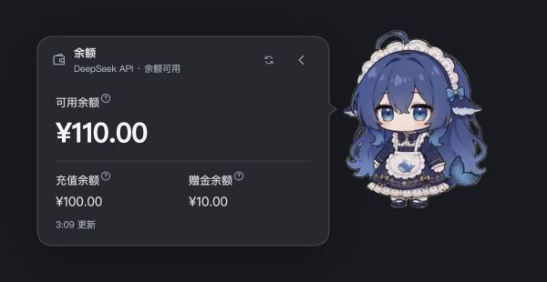

<div align="center">

# Kujira · 鲸鱼娘

**DeepSeek Harness Web 桌宠插件** — 查看任务进度、会话费用和账户余额，支持峰谷调度、互动养成与独立桌面模式。

[English](README.en.md) · [下载](https://github.com/YuluoY/dsh-kujira/releases) · [使用说明](docs/USAGE.md) · [桌面模式](docs/DESKTOP.md) · [反馈](https://github.com/YuluoY/dsh-kujira/issues)

[](https://github.com/YuluoY/dsh-kujira/releases) [](https://github.com/YuluoY/dsh-kujira/actions/workflows/desktop.yml) [](LICENSE)


<sub>独立预览截图；下方余额面板使用演示金额。</sub>

</div>

## ✨ 功能特性

- **任务进展** — 显示当前操作、计划和子代理状态，展开查看结果与文件，通过入口跳转到对应会话。
- **峰谷调度** — 同一 DSH 服务中的主代理和子代理，峰价暂停、谷价续跑；默认关闭，在设置中开启。
- **费用与余额** — 输入框右下方显示峰谷状态和当前会话与嵌套子代理的合计费用；余额读取 DSH 已配置的 DeepSeek 账户。
- **互动养成** — 130 段同人物透明动画覆盖待机、工作、作息、节日和互动；连续使用物品无冷却，消费按可配置概率掉落物品，可开启无限互动。运行中不调用模型生成回应，也不预加载全部素材。
- **桌面模式** — Electron 桌面应用独立运行，与浏览器插件共用人物、动画和设置；支持浏览器/桌面显示接管、托盘菜单、透明区域鼠标穿透和置顶，可从人物菜单或托盘按需启动本机 DSH。
- **个性化** — 调整位置、大小、气泡停留时间和菜单数量；设置自动保存，连续调整防抖；支持中、英、韩、俄及跟随系统。
- **扩展** — 天气、GitHub 快捷入口，以及供外部插件注册功能的[扩展 API](docs/EXTENSIONS.md)。

<div align="center">
  
</div>

## 📦 安装

需要 Node.js 22.13+、pnpm 和可正常运行的 DeepSeek Harness Web，`dsh` 与 `pnpm` 命令须在 PATH 中。

在任意目录执行这一行，macOS、Linux 和 Windows 通用：

```sh
dsh plugin --profile web add https://github.com/YuluoY/dsh-kujira/releases/download/v0.2.4/dsh-kujira-0.2.4.tgz
```

DSH 自动下载、安装并注册插件，无需 Git、手动解压或进入项目目录。等正在执行的会话完成后，正常重启 DSH Web 并刷新页面。命令固定到明确版本；升级时使用新版发布包地址。

```sh
dsh plugin --profile web remove dsh-kujira
```

开发者需要链接本地源码时，可使用 `npm run setup`，详见[安装、更新与卸载](docs/INSTALL.md)。

已在 DSH **0.1.5-rc.1** 验证安装、真实余额与历史会话读取；调度使用该版本的 Agent 事件分发器验证。

## 📖 使用前了解

- 调度在 **Agent 步骤边界** 生效：已发出的模型请求或执行中的工具会先完成；手动取消的任务不会自动恢复，独立运行的其他 DSH 服务不受控制。
- 余额查询复用 DSH 凭据服务中的 `DEEPSEEK_API_KEY`，需要有效的 DeepSeek 官方 API 密钥；密钥只在宿主使用，不传给浏览器。
- 天气无需单独配置密钥：城市留空时按 DSH 服务的出口 IP 定位，填写城市则使用该城市；内置国内、国际天气源及失败回退。
- 切换国家／地区会按 Frankfurter 参考汇率显示人民币、美元、韩元或卢布（约合金额带 ≈ 标记）；实际账户和结算币种保持不变。

更多文档：[调度与补给规则](docs/USAGE.md) · [数据与隐私](docs/PRIVACY.md) · [动画及触发条件](docs/ANIMATIONS.md) · [性能与库存迁移](docs/PERFORMANCE.md) · [桌面模式](docs/DESKTOP.md)

## 🖥️ 可选桌面模式（预览版）

桌面应用可独立运行，通过人物菜单打开本机 DSH；插件安装方式不变，桌面运行环境单独安装。外观与本地养成快照在浏览器/桌面两端同步；库存、奖励及调度仍由 DSH 服务负责，离线不伪造交易。平台边界、默认配置与构建方法见[桌面模式文档](docs/DESKTOP.md)。可选桌面预览包见 [v0.2.4 Release](https://github.com/YuluoY/dsh-kujira/releases/tag/v0.2.4) 附件；这些预览包未签名。

## 🛠️ 开发

```bash
npm ci --legacy-peer-deps
npm run preview   # http://127.0.0.1:8792/
npm test          # 含 test:desktop 桌面模块测试
npm run lint
npm run typecheck
```

桌面应用开发与本地构建：

```bash
npm run desktop:install
npm run desktop:start
npm run desktop:build
```

无需前端构建。`lib/host` 处理宿主服务，`lib/shared/client` 与 `lib/shared/task` 负责界面，`lib/styles` 存放样式，`desktop/` 为 Electron 桌面应用。类型检查覆盖已标注的模型、资源模块，以及轮询与取消基础设施。库存使用工作线程中的 SQLite 事务，旧 JSON 自动迁移并保留备份。

预览提供状态、费用和长内容示例。任务与费用使用隔离的模拟数据；余额和天气可能访问真实接口。

## 🤝 参与贡献

欢迎提交 [Issue](https://github.com/YuluoY/dsh-kujira/issues) 和 [PR](https://github.com/YuluoY/dsh-kujira/pulls)：Bug、功能建议、文档修正和代码改进都欢迎，较大的改动建议先开 Issue 讨论。

反馈问题时请附 DSH 版本、复现步骤和必要截图，注意遮盖密钥及私人内容。修改界面时，请检查长文本、小窗口和四种语言。

联系作者：[GitHub @YuluoY](https://github.com/YuluoY) · 个人博客：[uluo.cloud](https://uluo.cloud/)。项目相关问题请优先通过 Issue 沟通。

## 🌸 致谢

- [yanzwzz/dsh-whale-girl-pet](https://github.com/yanzwzz/dsh-whale-girl-pet) — 动画素材。
- [PC2005-cloud/dsh-pet](https://github.com/PC2005-cloud/dsh-pet) — 新增同人物动画（MIT 许可随素材提供）与参考实现。

## 👥 贡献者

<div align="center">

[](https://github.com/YuluoY/dsh-kujira/graphs/contributors)

</div>

## ⭐ Star History

<div align="center">

[](https://www.star-history.com/#YuluoY/dsh-kujira&Date)

</div>

## 📄 许可

[MIT](LICENSE) © YuluoY。动画保留原作者版权；内置 [i18next](lib/shared/vendor/i18next.LICENSE) 与 [Marked](lib/shared/vendor/marked.LICENSE) 保留各自许可。
